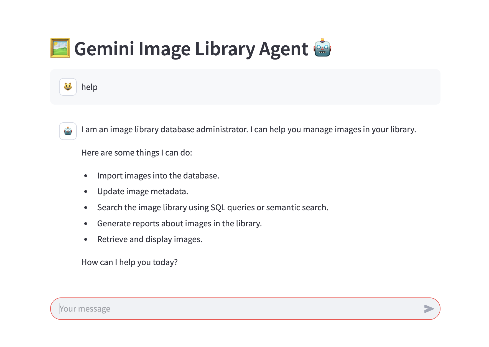
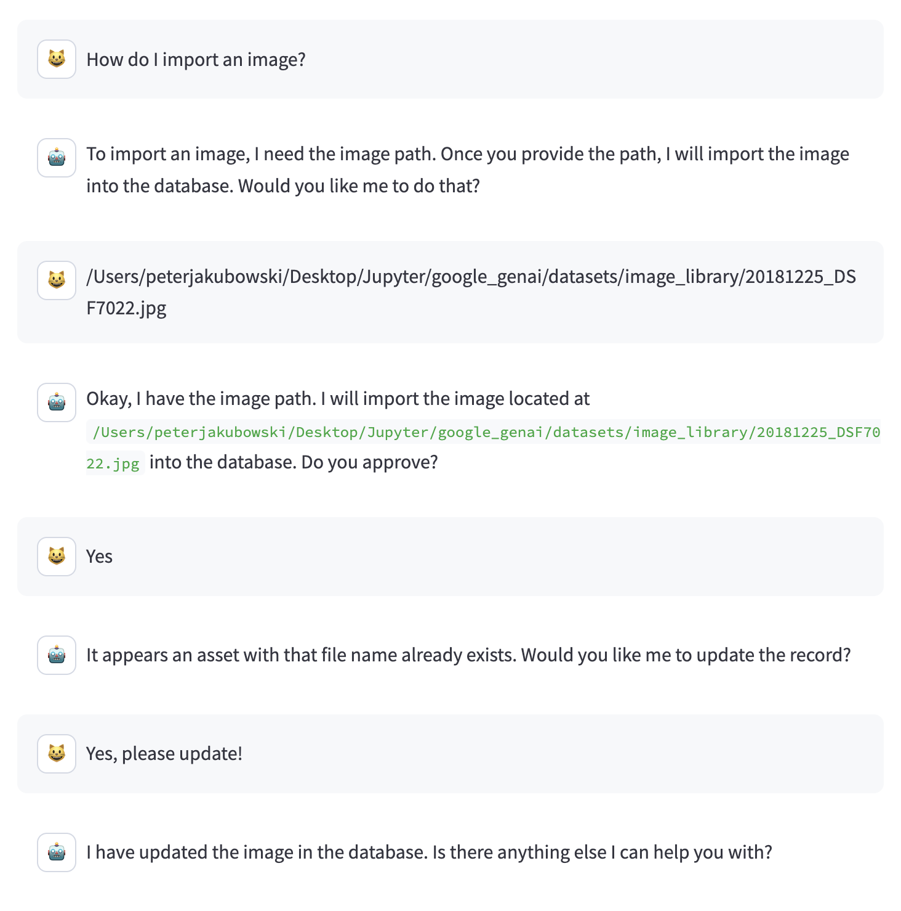
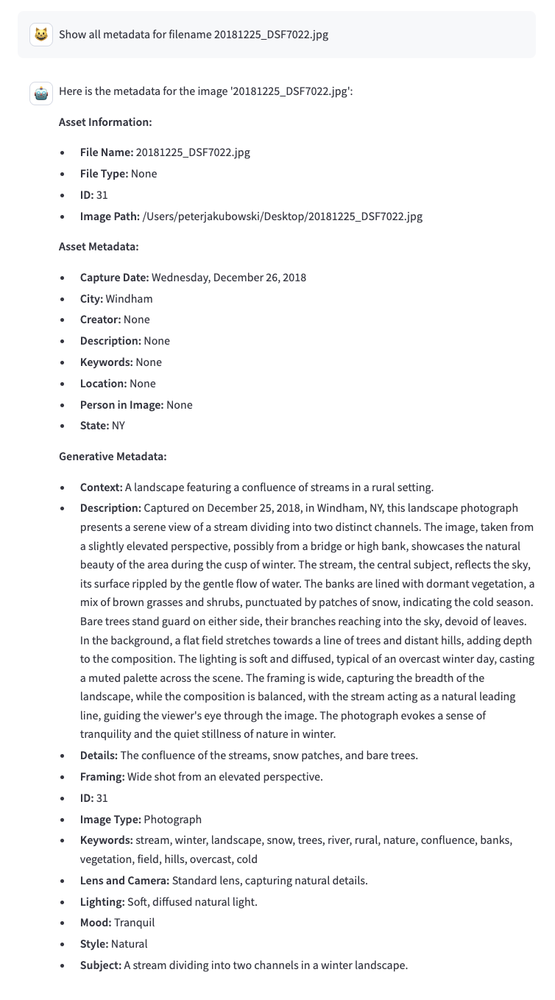
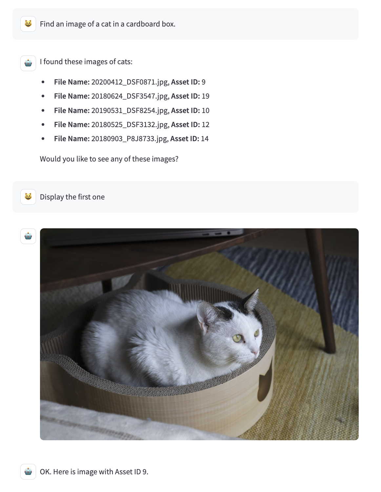
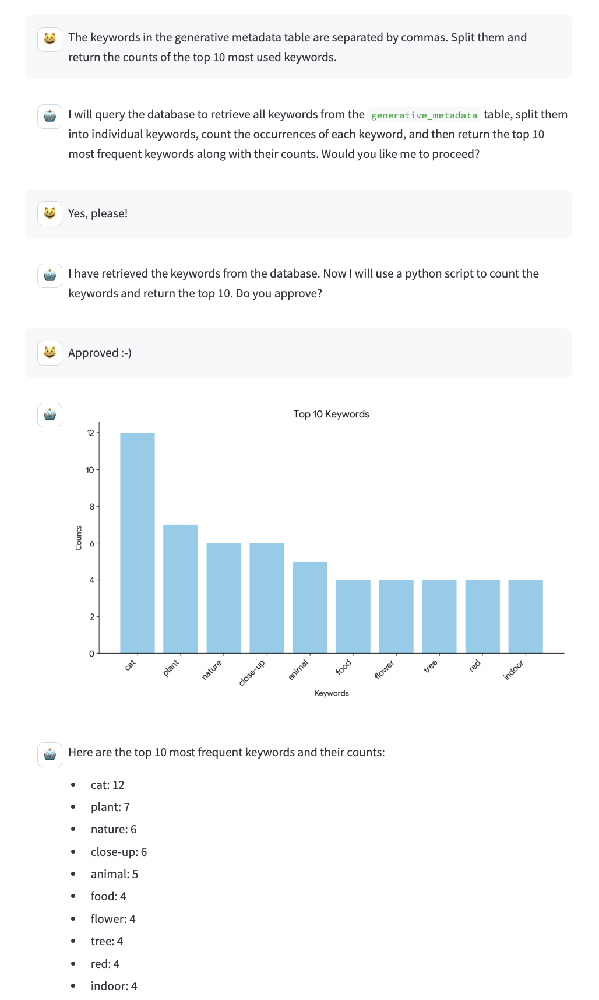

# Gemini-Image-Library-Agent

This project illustrates the beginnings of a basic digital asset management system that is powered by Google's Gemini API. The system is designed to support management of photography image libraries. The project current explores importing images into a database, capturing and generating descriptive metadata, and searching the image library–all with the help of a Gemini chat agent.

## Usage

The chat interface is run using streamlit. Enter the command below in your cli to launch the server in your web browser.

```commandline
streamlit run gemini_image_library_agent.py
```
## Tools

* **import_image** -  Open an image, get information and metadata about the image, and import it into the database.
* **update_assets** - Update a record in the assets table within the database.
* **update_asset_metadata** - Update a record in the asset_metadata table within the database.
* **update_genai_description** -  Update a record in the generative_metadata table within the database.
* **update_embedding** (not implemented) - Update a record in the embeddings table within the database.
* **search_image_library_sql** - Search the image library database using sql queries.
* **search_image_library_semantic** -  Search the image library using vector search.
* **python_code_execution** - Use a Gemini model to run python and execute code.
* **retrieve_and_display_image** - Search the database for an image and display it in the chat.
* **date_string_from_timestamp** - Search the database for the capture date of the image with the given id.
    Format the date as a string '%A, %B %d, %Y'.

## Examples

### Help



### Import




### Search and Display



### Report



## Google Gen AI SDK (Gemini API)

Google Gen AI Python SDK provides an interface for developers to integrate Google's generative models into their Python applications.

Documentation: [https://googleapis.github.io/python-genai/](https://googleapis.github.io/python-genai/)

pypi: [https://pypi.org/project/google-genai/](https://pypi.org/project/google-genai/)

### API Key

Keep your Gemini API in streamlit secrets.

Add a line to the secrets.toml file: GOOGLE_API_KEY="YOUR_GOOGLE_API_KEY"

```commandline
.streamlit/secrets.toml
```


